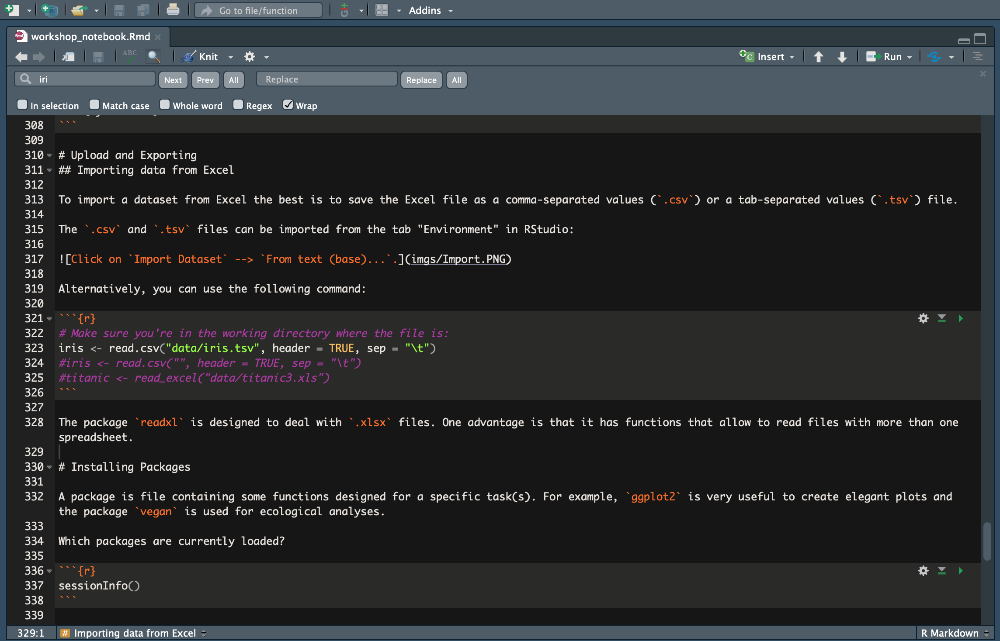
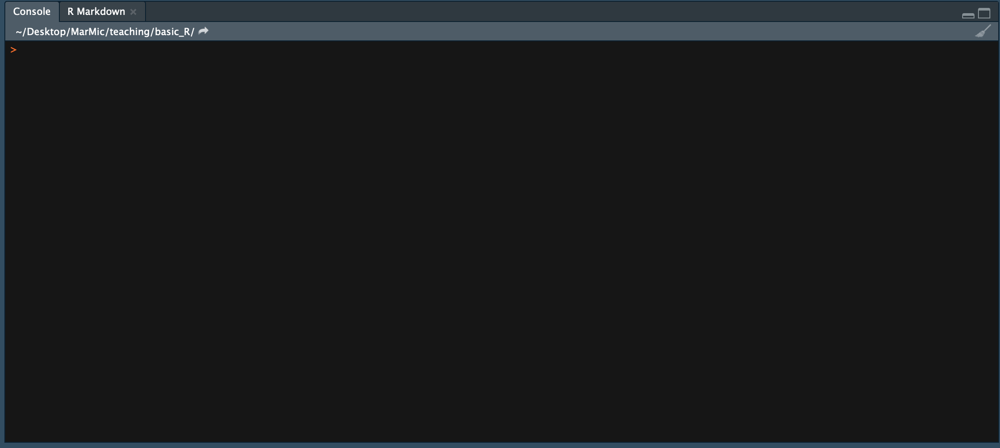
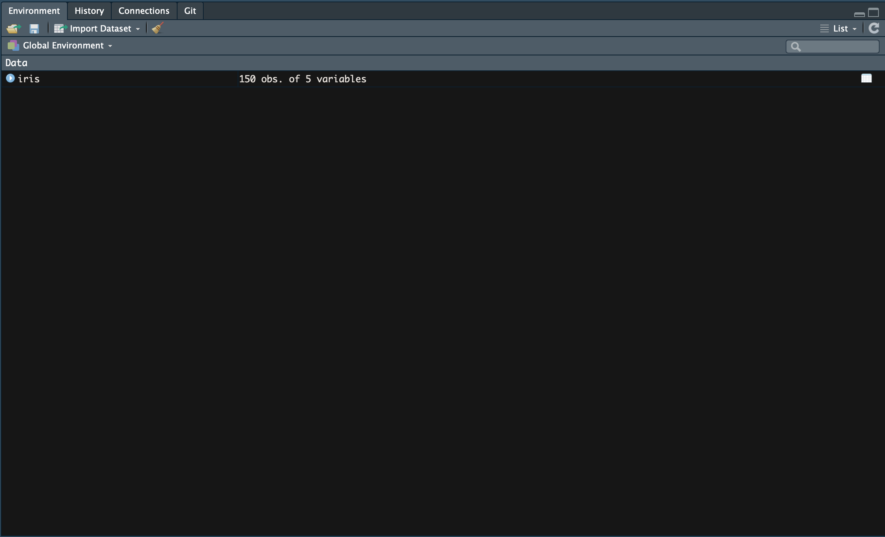
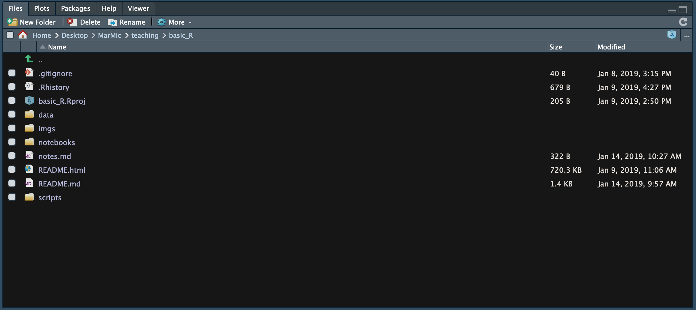

Ok, before we start, please run the code below to download a few packages for the course :)

```
install.packages("tidyverse")
install.packages("readxl")
install.packages("ggplot2")
install.packages("dplyr")
install.packages("car")
install.packages("gtools")
```


# Why R?
***

R is a programming language and free software environment for statistical computing and graphics supported by the R Foundation for Statistical Computing. The R language is widely used among statisticians and data miners for developing statistical software and data analysis. [Wikipedia](https://en.wikipedia.org/wiki/R_(programming_language))

In summary:

* R is free
* R is multi-platform (Windows, GNU-Linux, MacOSX)
* R has a great help system
* R has a lot of pre-installed statistical functions
* The user can create and apply their own functions in R
* R makes data analyses **reproducible**
* Great online community (i.e. [Stack Overflow](https://stackoverflow.com/questions/tagged/r), [#rstats](https://twitter.com/search?q=%23rstats&src=typd))
* Very popular among biologists

Here are some great open source resources for your references:

- [R for Data Science](https://r4ds.had.co.nz/)
- [Advanced R](http://adv-r.had.co.nz/)
- [Fundamentals of Data Visualization](https://serialmentor.com/dataviz/)
- [blogdown: Creating Websites with R Markdown](https://bookdown.org/yihui/blogdown/)
- [RStudio cheatsheets](https://www.rstudio.com/resources/cheatsheets/)


# General tips for learning R programming
***

* **Google is your friend!** All levels of programmers search the web for solutions to coding problems. As you continue to develop your R skills you will also develop an intuition to search for solutions faster.
* **Organize** your data, images, scripts, and notebooks into separate directories. You have a lot of worry about... the more organized you are better.
* **Comment your code!** Try to consistently write notes within your code to explain what you are doing and your results. If you don't, you WILL forget when you come back to it in the future. "Damn you, past self!"
* Stay positive and have fun :)

# Downloading R and RStudio
***

R versions can be downloaded from the [Comprehensive R Archive Network website](https://cran.r-project.org/). RStudio can be downloaded from the [website](https://www.rstudio.com/products/rstudio/download/).


# RStudio interface
***

### 1. Script window

Works as a text editor.


### 2. Console window

Here is where the R functions are executed.


### 3. Environment

Every data object or R object created during the session is stored here.


### 4. Plot/Help/etc window




# Introduction to R programming language
***

We are getting into the exciting stuff! Open RStudio and start a new R script. This is like a text file where we will write and execute our commands.

## Intro

When writing R code, using hashtags (#) to include comments is highly recommended to make the notes understandable. Example:

```{r}
print("Hello") # This command prints an initial greeting :)
```

## How to get help

Use `?` to read the help page of functions or data sets. For example:

`?R.version`

or 

`help(R.Version)`

The [RStudio cheatsheets](https://www.rstudio.com/resources/cheatsheets/) are a great resource.

Also check [Stack Overflow](https://stackoverflow.com/questions/tagged/r) frequently :)


## Object names

To assign an object to a name we use `<-` (equivalent to `=`). The shortcut for `<-` is `Alt + -`. Names...

* ... are case sensitive
* ... can contain letters, numbers, "." and "_". They should start with a letter.
* ... should not have function or operator names: `function`, `if`, `c`...

Tip: give clear and descriptive names to R objects and data.

Example: create:

```{r}
Greeting <- print("Hello world!")

Greeting
```

## Data objects

The types of objects in R:

* **Vectors**. String of characters/numbers/...
* **Factors**. For qualitative data: each caharacter is a "category".
* **Lists**. Can contain vectors of different types (integer, double, Boolean...).
* **Arrays**. Vectors organised by rows and columns. It can only store data of one type.
* **Data frames**. Like an array but can contain columns of different types. The columns are called *variables*. A data frame is the most common way of storing data in R.

Some examples:

```{r}
# Vectors
x <- c(8,2,5,6,7)
y <- c(34,23,67,65,23)
z <- c(TRUE, TRUE, FALSE, FALSE, TRUE)
w <- c("Hello", "Hallo", "Hola")

# Factors
a <- factor(c(1,2,3,4,5))
b <- factor(c("a", "b", "c", "d", "e"))

# Lists
l <- list(1:3, "a", c(TRUE, FALSE, TRUE), c(2.3, 5.9))
l
# The elements in a list can be named:
l_named <- list(int = 1:3, char = "a", bool = c(TRUE, FALSE, TRUE), dbl = c(2.3, 5.9))
l_named

# Array
num.data <- array(c(x, y, z), dim=c(5,3))
num.data # Note that the logical vector is turned into a vector of 0 and 1.
# You can also transpose an array:
num.data.t <- t(num.data)
num.data.t

# Data frame
my.data <- data.frame(num.data, row.names = b)
my.data
# You can also create your data frame in a more organised way:
my.data.org <- data.frame(x, y, z, row.names = b)
my.data.org
```

**YOUR TURN #1** - Make an R object with the names of your best friends and print it: create a vector with your friends' names

## Attributes of the objects

* Attributes `attributes`
* Mode `mode`
* Type `typeof`
* Names `names`
* Dimensions `dim`. Only in two-dimensional data.
* Names of the dimensions `dimnames`
* Class `class`

Check what are the attributes of the objects created before. For example:

```{r}
dim(x)
dim(my.data)
dimnames(my.data)
attributes(my.data.org)
# etc
```

**YOUR TURN #2** - Work in groups and create a data frame containing some information about your friends: the row names are the names of your friends, the first column is their age, the second column is their city of origin, the third column is their hair colour and the fourth column is... you choose! 
Explore the attributes, dimensions, dimension names, etc. of the `friends` data frame.
There are several ways to do it and we suggest you try your own. Here are some hints in case you need them:
a. You can create each variable as a vector: names, age, hair colour... Remember that you create vectors with the function `c()` and that you need to quote `"` text.
b. Paste the vectors together as a data frame (see the help for `?data.frame`) and specify the row names using the `names` object.
c. Ask us if you need further help.


## Subsetting objects


With the function `c()` we can generate **strings** of values. With the coordinates (square brackets, `[` and `]`) we can **select** specific elements from strings. With the operator `$` we can access columns in a **data frame** by the variable name.

You can find some help on subsetting [here](http://www.statmethods.net/management/subset.html) and [here](http://adv-r.had.co.nz/Subsetting.html)

Examples:

```{r}
# Generate a vector of consecutive numbers:
g <- c(1:7)
g

# Select specific elements from a vector
x
x[2]
x[c(2,4)]
x[2:4]

# Select specific elements from a matrix.
num.data
num.data[1, 1]
num.data[1:3, c(1,3)]
# This is useful to make subsets:
num.data.subset <- num.data[,1:2]
num.data.subset

# You can also delete a row or column with the minus (-) sign
# Remove the first row:
num.data[-1, ]
# Remove the third column:
num.data[ ,-3]

# Access the variables in a data frame.
my.data.org$x
my.data.org$y
```

**YOUR TURN #3** - You've decided you're not friends with one of people in the `friends` data frame anymore. Remove their information from your data frame.

## Dealing with NAs

Identifying and replacing non-available (NA) values in our data sets can be useful and necessary for :

```{r}
v <- c(1, 5, 19, 2, 23, NA, 3, 9, NA)
v

# identify NAs
is.na(v)
which(is.na(v))

# Identify non-NAs:
complete.cases(v)


# Create a vector without the NAs
w <- v[!is.na(v)]
w

# Substitute NAs for e.g. 0
v2 <- v
v2[is.na(v2)] <- 0
v2

# NAs can be removed in some functions
mean(v)
mean(v, na.rm=TRUE)
```

# Importing and exporting data
***

## Importing data from Excel

We can import a data set from Excel from the environment window i RStudio:


If your data is already organised into columns, tick the box "Headings".

An alternative is to save the Excel file as a comma-separated values (`.csv`) or a tab-separated values (`.tsv`) file. The `.csv` and `.tsv` files can also be imported from the tab "Environment" in RStudio or you can use this command:

```{r}
Mforsetti <- read.csv("data/Maribacter_forsetti_OD.csv", header = TRUE, sep = ";")
```

Check out your data

```{r}
head(Mforsetti)

tail(Mforsetti)
```

## Exporting data

We will subset the last lines of the data frame and save it as a new file:

```{r}
Mforsetti_tail <- tail(Mforsetti)

# csv
write.csv(Mforsetti_tail, file = "data/Mforsetti_tail.csv", quote = FALSE, row.names = FALSE, col.names = TRUE)

# tsv
write.table(Mforsetti_tail, file = "data/Mforsetti_tail.tsv", sep = "\t", quote = FALSE, row.names = FALSE, col.names = TRUE)
```


# Installing Packages
***

A package is file containing some functions designed for a specific task(s). For example, `ggplot2` is very useful to create elegant plots and the package `vegan` is used for ecological analyses.

The package `readxl` is designed to deal with `.xlsx` files. One advantage is that it has functions that allow to read files with more than one spreadsheet.

Which packages are currently loaded?

```{r}
sessionInfo()
```

To install a package and to activate it in the current workspace we do:

```
# To install a package (this task can take a while and may ask for additional packages to be installed):
install.packages("ggplot2")

# To call the package and use its functions in the current session use:
library(ggplot2) # or:
require(ggplot2)
```

# Tidyverse
***

The Tidyverse packages are a modern set of functions that are based on [the tidy tools manifesto](https://cran.r-project.org/web/packages/tidyverse/vignettes/manifesto.html) by Hadley Wickham. Two of the principles in the manifesto that we believe are important for teaching R are:

- Compose simple functions with the pipe `%>%` (shortcut `Cntr + Tab + m`)
- More human-readable than base R

```{r}
# load required packages ####
library(readxl)
library(ggplot2)
library(car)
library(dplyr)
library(gtools)
```

## 1. Introduction to `dplyr`

The [`dplyr` package](https://dplyr.tidyverse.org/) allows you to interact with data frames and tibbles (a task most biologist will be doing). The package is easy to learn because it is based around using verbs to manipulate your data frames. In fact, `dplyr` is referred to as, "the grammar of data manipulation." Here are the verbs we will learn about today:
  
* `select()`: return specific columns of a data frame
* `filter()`: extract rows of a data frame that meet specified conditions
* `summarise()`: return summary statistics for your data frame
* `mutate()`: add a new column to your data frame
* `rename()`: rename the title of a column

Let's begin using Tidyverse functions with microbial growth data.

```{r}
# data import ####
raw_growth_data<-read_excel("data/Maribacter_forsetti_OD.xlsx")

head(raw_growth_data)
```

How to pipe with `%>%` (shortcut `Cntr + Tab + m`).

```{r}
# Which timepoints were measured?
raw_growth_data %>%
  select(time_h)

# when was the the OD in the glucose incubation higher than 0.2?
raw_growth_data %>%
  filter(glucose>0.2)%>%
  select(c(time_h, glucose))

# what was the max OD of the glucose incubation? note that "max_OD" is just a name, could be anything
raw_growth_data %>%
  summarise(max_OD= max(glucose))
  
# what was the mean OD of the glucose incubation between 60 h and 180 h incubation?
raw_growth_data %>%
  filter(time_h> 60 & time_h<180) %>%
  summarise(mean_OD_60to180h = mean(glucose), measurements = n())
```

**YOUR TURN #4**:
a. look at the time and the ODs of the arabinan and the debranched arabinan together
b. report the maximum OD for arabinan and the maximum OD for debranched arabinan
c. choose a time interval and calculate the mean OD of the arabinan and the debranched arabinan incubation
BONUS: also calculate the standard deviation for the chosen time interval

```{r}
# save information derived from data set using <-
times <- raw_growth_data %>%
  select(time_h)

glucose_info <- raw_growth_data %>%
  filter(time_h > 100) %>%
  summarise(mean_glucose = mean(glucose), sd_glucose = sd(glucose))

control_info <- raw_growth_data %>%
  filter(time_h > 100)%>%
  summarise(mean_control = mean(control), sd_control = sd(control))

raw_growth_data %>%
  mutate(glucose-control)

difference<- raw_growth_data %>%
  mutate(difference = glucose-control) %>%
  select(difference)

raw_growth_data$difference <- difference

raw_growth_data %>%
  rename(diff = difference)

```

**YOUR TURN #5**: calculate the difference between arabinan and debranched arabinan and add it as a new column.


## 2. Explore plotting with `ggplot2`

In this [link](https://ggplot2.tidyverse.org/) you can see the introduction and manual to `ggplot2`.

In most cases you start with `ggplot()`, supply a dataset (with `data()`) and aesthetic mapping (with `aes()`). You then add on layers (like `geom_point()` for a dot plot, or `geom_histogram()` for a histogram, `geom_bar()` for a bar plot, ...), scales (like `scale_colour_brewer()`), themes, etc. Better see some examples:

```{r}
ggplot(data=raw_growth_data)+
  geom_point(aes(x=time_h, y=glucose))

ggplot(data=raw_growth_data)+
  geom_point(aes(x=time_h, y=glucose))+
  geom_point(aes(x=time_h, y=control), color="blue", size=2, pch=25, fill="pink")+
  theme_light()
```

**YOUR TURN #6**
a. try out plotting different incubations like arabinan etc.
b. try different colors
c. try to use geom_line instead of geom_point

BONUS: have lunch


## 3. Deal with the pattern in microbial growth (lag - exponential - stationary)

The logit function in car computes the logit transformation 
logit = log[p/(1 - p)] 
for the proportion p.

If p = 0 or 1, then the logit is undefined. logit can remap the proportions to 
the interval (adjust, 1 - adjust) prior to the transformation. If it adjusts the 
data automatically, logit will print a warning message. 

```{r}
ggplot(data=raw_growth_data)+
  geom_point(aes(x=time_h, y=car::logit(glucose/max(glucose))))+
  theme_light()

ggplot(data=raw_growth_data)+
  geom_point(aes(x=time_h, y=car::logit(glucose/max(glucose), adjust = 0.01)))+
  theme_light()
```


Does the logit function do the trick?
Let's focus on the more relevant part of the glucose incubation.

```{r}

glucose_growth_phase<-raw_growth_data %>%
  filter(time_h<180)

ggplot(data=glucose_growth_phase)+
  geom_point(aes(x=time_h, y=car::logit(glucose/max(glucose))))+
  theme_light()

```

Now we can compare the original and the logit transformed data.
We will try to do a regression over incubation time with each of them.

```{r}
model_glucose<-lm(glucose~time_h, glucose_growth_phase)

logit_model_glucose<-lm(car::logit(glucose/max(glucose), adjust = 0.01)~time_h, 
                        glucose_growth_phase)
summary(logit_model_glucose)

```

## Your turn
Try different values for the adjust parameter and check the resulting models.
Do you notice any changes?


We can use the calculated model parameters to visualize the regressions.
  First, we will extract the parameters for the slope and the intercept.
  Second, we will create a plot with lines for both models.

The only difficulty here is that we have to transform the values from the
logit model back, otherwise the values are nonsense. But don't worry, we'll 
show you how.
```{r}

original_slope<- model_glucose$coefficients[2]
original_intercept<- model_glucose$coefficients[1]

ggplot(data=raw_growth_data)+
  geom_point(aes(x=time_h, y=glucose))+
  geom_line(aes(x=time_h, y=time_h*original_slope+original_intercept))+
  theme_light()

logit_slope<-logit_model_glucose$coefficients[2]
logit_intercept<-logit_model_glucose$coefficients[1]
```

With this done, we use the inv.logit function from the gtools package to 
get back to meaningful values from the logit model. As we previously divided
by the maximum value of the glucose incubation to get to proportions, now we have
to multiply by this value.

```{r}
ggplot(data=raw_growth_data)+
  geom_point(aes(x=time_h, y=glucose))+
  geom_line(aes(x=time_h, y=time_h*model_glucose$coefficients[2]+model_glucose$coefficients[1]))+
  geom_line(aes(x=time_h, 
                y=inv.logit(time_h*logit_slope+logit_intercept)*max(glucose)))+
  theme_light()
```
Neat!

Finally, we can really model how the curve would look like with OD measurements 
done every hour over the first 350 h given the calculated slopes and intercepts.

To do so, we'll use the seq command, which generate a vector with a sequence of
numbers from the first number given up to the second number given in intervals
of the third number given. In our plot, we then use this sequence instead of 
the original sampling times.

Note that now the point that we plot and the lines that we plot stem from
two separate datasets, so we have to save the maximum value for glucose first.

```{r}
model_time<-seq(0,350,1)
model_max<-as.numeric(raw_growth_data %>%
  summarise(max(glucose)))

ggplot()+
  geom_point(data=raw_growth_data, aes(x=time_h, y=glucose))+
  geom_line(aes(x=model_time, y=model_time*original_slope+original_intercept))+
  geom_line(aes(x=model_time, 
                y=inv.logit(model_time*logit_slope+logit_intercept)*model_max))+
  theme_light()
```

## Your turn: try to model the growth with a substrate of your choice

```{r}
ggplot(data=raw_growth_data)+
  geom_point(aes(x=time_h, y=arabinan))

# Comments: 
# a. plot looks like ass
# b. sigmoidal shape

ggplot(data=raw_growth_data)+
  geom_point(aes(x=time_h, y=logit(arabinan/max(arabinan))))

arabinan_growth_phase<-raw_growth_data %>%
  filter(time_h<150L)

model_arabinan<-lm(arabinan~time_h, arabinan_growth_phase)

logit_model_arabinan<-lm(car::logit(arabinan/max(arabinan))~time_h, arabinan_growth_phase)
summary(logit_model_arabinan)


ggplot(data=raw_growth_data)+
  geom_point(aes(x=time_h, y=arabinan))+
  geom_line(aes(x=time_h, y=time_h*model_arabinan$coefficients[2]+model_arabinan$coefficients[1]))+
  geom_line(aes(x=time_h, 
                y=inv.logit(time_h*logit_model_arabinan$coefficients[2]+logit_model_arabinan$coefficients[1])*max(arabinan)))+
  theme_classic()
```


# Bar plot with 16S rRNA data
***

Now let's check some basic notions of bar plots with 16S data.

```{r}
# Load packages:
library(tidyr)
library(dplyr)
library(ggplot2)
```

The data were generated with [`phyloFlash`](https://github.com/HRGV/phyloFlash) by extracting 16S rRNA genes and mapping metagenomic reads to estimate abundances. They belong to three different cultures, but let's just focus on one of them for the sake of simplicity :)

```{r}
# Load the data:
data <- read.table(file = "data/16S_data_phyloflash.tsv", header=T)

# Check it out:
head(data)

# Create tibble (dataframe readable for tidyverse):
data.tb <- tibble(data)

# Create subset: filter only the sample "Methane70":
data.tb.subset <- data.tb %>% filter(sample=="Methane70")

# Create a column with relative abundances of each taxon:
data.tb.subset <- data.tb.subset %>% mutate(rel_abun=(reads/sum(reads)))

# the plot 
ggplot(data=data.tb.subset, aes(x=sample, y=rel_abun, fill=taxonomy))+ 
  geom_bar(stat="identity", position="stack", color="black")

```

Can you see the problem in the plot above? 

There are too many taxa with low abundance!! Time to do some subset engineering. Let's collapse taxa with <1% relative abundance into a generic category.

```{r}

# Rename the taxonomy row where the relative abundance is lower than 0.01:
data.tb.subset$taxonomy[ data.tb.subset$rel_abun<0.01 ] <- "taxa <1% relative abundance"

# Let's generate the plot with the new dataset:
data.plot <- ggplot(data=data.tb.subset, aes(x=sample, y=rel_abun, fill=taxonomy))+ 
  geom_bar(stat="identity", position="stack", color="black")
# Here's the plot:
data.plot
```

The plot looks strange in the document because of the large legend, but it will (hopefully!) look better in the lower right corner of your RStudio window. Let's save the plot in case we want to 

```{r}
# Let's save the plot for further processing
ggsave(filename = "16S_plot.pdf", plot=data.plot, device="pdf", width=25, height=15, units="cm")
```

Here's a really simple first bar plot. You can explore the `ggplot2` universe in google to beautify your plot or you can edit it with some image processing software.


# Some useful packages
***

Here are some useful R packages for (micro)biologists:

* **`ggplot2`**. The reference package for plotting. [Here](http://girke.bioinformatics.ucr.edu/CSHL_RNAseq/mydoc/mydoc_Rgraphics_5/) you can find a manual and [here](https://rstudio.com/wp-content/uploads/2015/03/ggplot2-cheatsheet.pdf) you can find the super useful cheatsheet.
* **`vegan`** contains some multivariate statistics functions for community ecology. Find the vignette [here](https://cran.r-project.org/web/packages/vegan/vegan.pdf).
* **`dada2`**. You can do 16S amplicon analysis in R with this package. Find all information and tutorials [here](https://benjjneb.github.io/dada2/tutorial.html).
* **`phyloseq`**. Super powerful package for microbiome data analysis. Really useful for plots: alpha diversity, phylogenetic trees, heatmats, bar plots... Check all the information and tutorials [here](https://joey711.github.io/phyloseq/).
* **`gbtools`** allows interactive visualisation of metagenomic bins in R. Starting from assembled contigs, with mapped data and functional genes annotates, you can extract bins from metagenomes. Follow the manual [here](https://github.com/kbseah/genome-bin-tools/wiki).


## Document edition and interactive notebooks in R: R markdown and R notebooks
***

R can use markdown syntax to generate texts with embedded code and plots (for example, the text you are reading right now). It's a bit different to R script notation but really useful as well!. Check the [R markdown cheatsheet](https://www.rstudio.com/resources/cheatsheets/) for markdown help.

In this section, let's open the file `workshop_notebook.Rmd` in R Studio and check it in parallel to the `workshop_notebook.html` file. We have created a R notebook (written in R markdown) that can be "knitted" to generate an `html` document.

The elements of an R Markdown document are:

* the header. This is where the title, author, date and output format is specified. Output format can be `.pdf`, `.html`, `.docx`...
* the main text. It can include sections, bullet points, tables, etc. Sorry to repeat ourselves, but check the [R markdown cheatsheet](https://www.rstudio.com/resources/cheatsheets/) for more information :)
* code chunks. To insert an R code chunk type `Cntrl + Alt + I` or go to the `Insert` tab in the script window in R Studio. The chunks work like tiny R scripts and you can also include comments inside using hash tags (#). Apart from R code, you can include chunks for other coding languages.

R notebooks are a great tool to create, for example, an interactive bioinformatics lab book. 


## Credits
***

The contents of this workshop were adapted from ["Curso básico de R"](http://www.ub.edu/stat/docencia/EADB/Curso%20basico%20de%20R.pdf) by Francesc Carmona, the [P2P course](https://rawgit.com/genomewalker/p2p/master/friday/P2P_r_crash_course.html#32_ggplot2) by Antonio Fernàndez-Guerra and Pelin Yilmaz and [Happy Belly Bioinformatics' R basics](https://astrobiomike.github.io/R/basics) by Michael D. Lee.


## Contributors
***

Name | GitHub handle | email
---|---|---
David Benito | [dbenitom](https://github.com/dbenitom) | dbenito@mpi-bremen.de
Hagen Buck-Wiese | [Buck-Wiese](https://github.com/Buck-Wiese) | hbuck@mpi-bremen.de
[Matthew Schechter](https://orcid.org/0000-0002-8435-3203) |  [mschecht](https://github.com/mschecht) | mschechter@uchicago.edu
Chiara Vanni | [ChiaraVanni](https://github.com/ChiaraVanni) | cvanni@mpi-bremen.de
